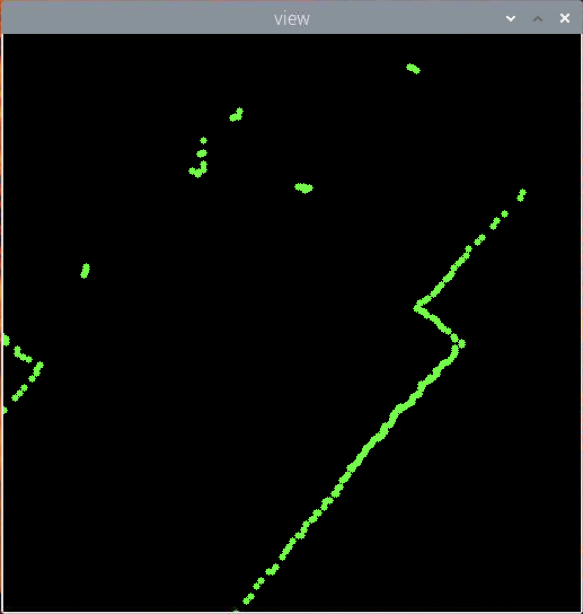
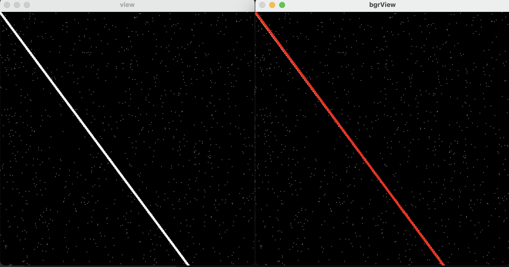
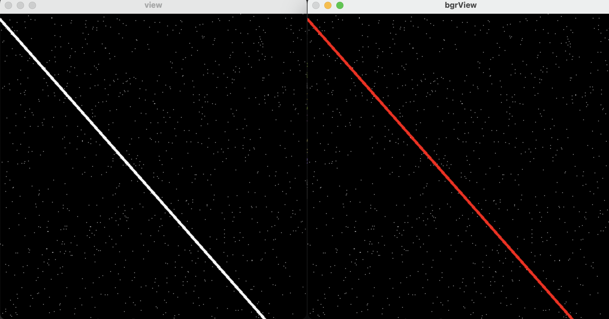
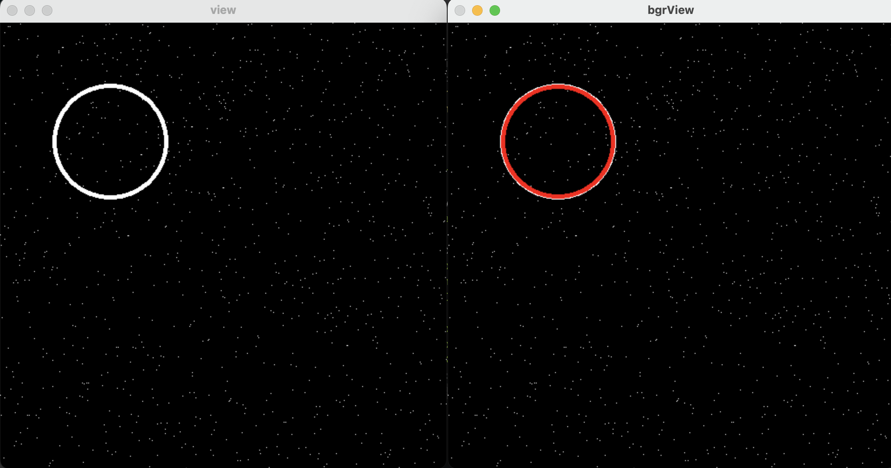
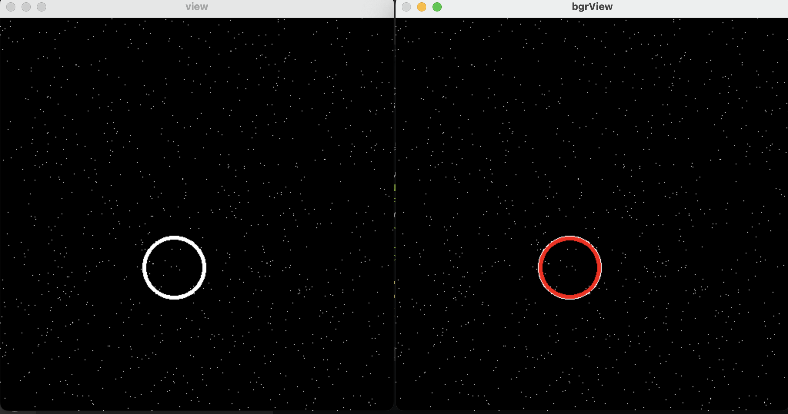
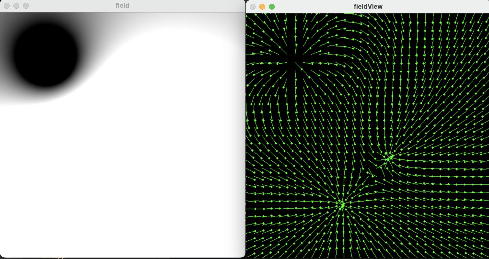
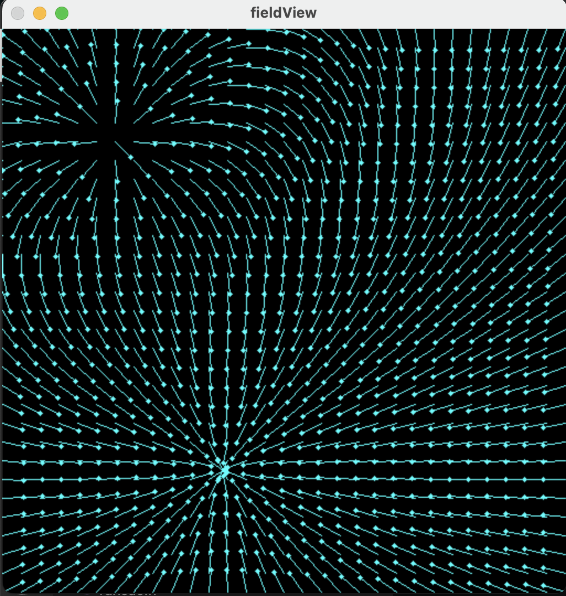

# QEADynamicPlanning
QEA小车最终测试（动态路径规划）


## 项目简介
本项目旨在利用激光雷达实现在固定矩形区域内扫描和检测方形垃圾桶作为障碍物，以及圆形垃圾桶作为目标物。通过使用梯度上升法自动规划最优路径，从机器的当前位置到达目标圆形垃圾桶，并且能够自动避开方形垃圾桶。在测试过程中，还会进行人为随机改动障碍物的位置。


## PID算法编写
由于我们项目中会用到很多次PID算法，所以我们将PID算法写成库的形式供其他模块调用。  

定义PID句柄结构体:
```c++
enum PIDType
{
    PIDType_Pos = 1, //位置式
    PIDType_Inc = 2, //增量式
};

volatile struct PIDHanldeDef
{
    double kp; //p比例系数
    double ki; //i比例系数
    double kd; //d比例系数
    double value; //实际测量值
    double target; //目标值
    double error; //误差
    double totalError; //总误差
    double lastError; //上一次误差
    double lastError2; //上上一次误差
    double minPWM; //最小输出PWM
    double maxPWM; //最大输出PWM
    double pwm; //最终输出PWM
    enum PIDType pidType; //PID算法类型
};
```

创建PID句柄
```c++
void CreatePID(volatile struct PIDHanldeDef* def, enum PIDType pidType, double kp, double ki, double kd, double minPWM, double maxPWM)
{
    def->kp = kp;
    def->ki = ki;
    def->kd = kd;
    def->value = 0;
    def->target = 0;
    def->error = 0;
    def->totalError = 0;
    def->lastError = 0;
    def->lastError2 = 0;
    def->minPWM = minPWM;
    def->maxPWM = maxPWM;
    def->pwm = 0;
    def->pidType = pidType;
}
```
外部程序通过调用PIDTick完成一次PID计算
```c++
double PIDTick(volatile struct PIDHanldeDef* def, double newValue)
{
    def->value = newValue;
    switch (def->pidType) {
        case PIDType_Pos: //位置式PID
            PosTick(def);
            break;
        case PIDType_Inc: //增量式PID
            IncTick(def);
            break;
    }
    return def->pwm;
}
```
位置式PID实现原理
```c++
void PosTick(volatile struct PIDHanldeDef* def)
{
    def->lastError = def->error;
    def->error = def->target - def->value;
    def->totalError += def->error;

    double pwm = def->kp * def->error +
                 def->ki * def->totalError +
                 def->kd * (def->error - def->lastError);
    def->pwm += pwm;
    if (def->pwm > def->maxPWM) def->pwm = def->maxPWM;
    if (def->pwm < def->minPWM) def->pwm = def->minPWM;
}
```
增量式PID实现原理
```c++
void IncTick(volatile struct PIDHanldeDef* def)
{
    def->lastError2 = def->lastError;
    def->lastError = def->error;
    def->error = def->target - def->value;

    double pwm = def->kp * (def->error - def->lastError) +
                 def->ki * def->error +
                 def->kd * (def->error - 2 * def->lastError + def->lastError2);
    def->pwm += pwm;
    if (def->pwm > def->maxPWM) def->pwm = def->maxPWM;
    if (def->pwm < def->minPWM) def->pwm = def->minPWM;
}
```


## 电机速度PID控制
我们通过增量式PID算法实现小车电机速度的闭环控制。 


电机PID控制结构体：
```c++
volatile struct WheelPWM
{
    volatile struct PIDHanldeDef pidHanldeDef; //pid算法句柄
    double speed; //电机速度
    double dis; //路程
    double pwm; //最终输出pwm
};
```
初始化电机PID控制
```c++
void Wheel_PID_Init()
{
    CreatePID(&leftPWM.pidHanldeDef, PIDType_Inc, 960, 240, 0, -1200, 1200);
    CreatePID(&rightPWM.pidHanldeDef, PIDType_Inc, 960, 240, 0, -1200, 1200);
}
```
完成一次电机PID计算并更新PWM
```c++
void Wheel_PID_Tick()
{
    //获取左右轮速度
    leftPWM.speed = (short) __HAL_TIM_GET_COUNTER(&htim8);
    __HAL_TIM_SET_COUNTER(&htim8, 0);
    rightPWM.speed = (short) __HAL_TIM_GET_COUNTER(&htim4);
    __HAL_TIM_SET_COUNTER(&htim4, 0);

    //通过速度积分计算行驶过的路程
    leftPWM.dis += leftPWM.speed;
    rightPWM.dis += rightPWM.speed;

    //计算一次pid
    leftPWM.pwm = PIDTick(&leftPWM.pidHanldeDef, leftPWM.speed);
    rightPWM.pwm = PIDTick(&rightPWM.pidHanldeDef, rightPWM.speed);

    //更新左轮pwm
    if (leftPWM.pwm > 0) {
        __HAL_TIM_SET_COMPARE(&htim3, TIM_CHANNEL_3, leftPWM.pwm);
        __HAL_TIM_SET_COMPARE(&htim3, TIM_CHANNEL_4, 0);
    } else if (leftPWM.pwm < 0) {
        __HAL_TIM_SET_COMPARE(&htim3, TIM_CHANNEL_3, 0);
        __HAL_TIM_SET_COMPARE(&htim3, TIM_CHANNEL_4, -leftPWM.pwm);
    } else {
        __HAL_TIM_SET_COMPARE(&htim3, TIM_CHANNEL_3, 0);
        __HAL_TIM_SET_COMPARE(&htim3, TIM_CHANNEL_4, 0);
    }

    //更新右轮pwm
    if (rightPWM.pwm > 0) {
        __HAL_TIM_SET_COMPARE(&htim3, TIM_CHANNEL_1, rightPWM.pwm);
        __HAL_TIM_SET_COMPARE(&htim3, TIM_CHANNEL_2, 0);
    } else if (rightPWM.pwm < 0) {
        __HAL_TIM_SET_COMPARE(&htim3, TIM_CHANNEL_1, 0);
        __HAL_TIM_SET_COMPARE(&htim3, TIM_CHANNEL_2, -rightPWM.pwm);
    } else {
        __HAL_TIM_SET_COMPARE(&htim3, TIM_CHANNEL_1, 0);
        __HAL_TIM_SET_COMPARE(&htim3, TIM_CHANNEL_2, 0);
    }
}  
```
启动电机PID速度控制
```c++
    //启动编码器
    HAL_TIM_Encoder_Start(&htim4, TIM_CHANNEL_1 | TIM_CHANNEL_2);
    HAL_TIM_Encoder_Start(&htim8, TIM_CHANNEL_1 | TIM_CHANNEL_2);

    //开启pwm输出 驱动频率30kHz 0-1200
    HAL_TIM_PWM_Start(&htim3, TIM_CHANNEL_1);
    HAL_TIM_PWM_Start(&htim3, TIM_CHANNEL_2);
    HAL_TIM_PWM_Start(&htim3, TIM_CHANNEL_3);
    HAL_TIM_PWM_Start(&htim3, TIM_CHANNEL_4);

    //开启编码器速度采集 1kHz
    HAL_TIM_Base_Start_IT(&htim7);
```
在定时器回调函数中调用PID控制算法：
```c++
void HAL_TIM_PeriodElapsedCallback(TIM_HandleTypeDef *htim)
{
  /* USER CODE BEGIN Callback 0 */

  /* USER CODE END Callback 0 */
  if (htim->Instance == TIM6) {
    HAL_IncTick();
  }
  /* USER CODE BEGIN Callback 1 */

  //进行一次pid计算
  if (htim->Instance == TIM7) {
      Wheel_PID_Tick();
  }

  /* USER CODE END Callback 1 */
}
```

## 读取解析IMU数据
我们通过STM32CubeMX配置IMU串口和FreeRTOS，在DMA中断回调函数中使用双缓冲接收串口数据，并通过任务通知将接收到的数据传递给IMUDecoder任务来进行解析。
IMUDecoder任务函数：
```c++
void IMUDecoder(void *argument)
{
  /* USER CODE BEGIN IMUDecoder */
    imuTaskHandle = xTaskGetCurrentTaskHandle(); //将当前任务句柄送给imu
    /* Infinite loop */
    for(uint32_t cnt = 0; ; ++cnt)
    {
        if (HAL_UART_STATE_READY == HAL_UART_GetState(&huart2)) {
            HAL_UART_Receive_DMA(&huart2, imuRecvBuff, 128); //开启imu串口通信
        }

        uint32_t value = 0;
        if (pdTRUE == xTaskNotifyWait(0, 0xffffffff, &value, pdMS_TO_TICKS(100)) && value == 0x12345678) {
            while (!DecodeIMUPackage()) {} //解析imu数据包
        }
        osDelay(1);
    }

  /* USER CODE END IMUDecoder */
}
```
通过串口传输完一半和传输完回调函数实现双缓冲。  
DMA中断回调函数：
```c++
void IMU_RxHalfCpltCallback()
{
    imuPackage = imuRecvBuff + 0;
    //通知解析imu任务
    BaseType_t flag = 0;
    xTaskNotifyFromISR(imuTaskHandle, 0x12345678, eSetValueWithOverwrite, &flag);
    portYIELD_FROM_ISR(flag);
}

void IMU_RxCpltCallback()
{
    imuPackage = imuRecvBuff + 64;
    //通知解析imu任务
    BaseType_t flag = 0;
    xTaskNotifyFromISR(imuTaskHandle, 0x12345678, eSetValueWithOverwrite, &flag);
    portYIELD_FROM_ISR(flag);
}
```
IMU解析函数：
```c++
int DecodeIMUPackage()
{
    if (imuPackage) {
        if (imuBuffOffset + 64 >= 1024) imuBuffOffset = 0;
        memcpy(imuBuff + imuBuffOffset, imuPackage, 64);
        imuBuffOffset += 64;
        imuPackage = 0;
    }
    //定位帧头
    int packageStart = 0;
    int flag = 0;
    for (; imuBuffOffset > 5 && packageStart < imuBuffOffset - 4; ++packageStart) {
        uint8_t crc8 = CRC8_Table(imuBuff + packageStart, 4);

        if (imuBuff[packageStart] == 0xFC && crc8 == imuBuff[packageStart + 4]) {
            flag = 1;
            break;
        }
    }
    //将帧头移动到起始位置
    if (flag) {
        memcpy(imuBuff, imuBuff + packageStart, imuBuffOffset - packageStart);
        imuBuffOffset -= packageStart;
    }

    int flag2 = 0;

    //判断帧头
    uint8_t crc8 = CRC8_Table(imuBuff, 4);
    if (imuBuff[0] == 0xFC && crc8 == imuBuff[4]) { //是帧头
        int cmd = imuBuff[1]; //指令类别
        int dataLen = imuBuff[2]; //数据长度

        //判断是否接收完整个数据
        if (imuBuffOffset >= 5 + 2 + dataLen + 1) { //5->帧头 2->crc16 1->帧尾标记
            uint16_t crc16FromBuff = (imuBuff[5] << 8) | imuBuff[6];
            uint16_t crc16 = CRC16_Table(imuBuff + 7, dataLen);

            if (crc16 == crc16FromBuff) {
                HandleIMUPackage(cmd, imuBuff + 7, dataLen);
                flag2 = 1;
            }

            int frameLen = 5 + 2 + dataLen + 1;
            memcpy(imuBuff, imuBuff + frameLen, imuBuffOffset - frameLen);
            imuBuffOffset -= frameLen;
        }
    }
    return flag2;
}
```
将IMU传感器数据发送给上位机
```c++
char message[128] = {0};
snprintf(message, 128, "[imu]heading:%.4f pitch:%.4f roll:%.4f\r\n", robotIMU.heading, robotIMU.pitch, robotIMU.roll);
HAL_UART_Transmit(&huart1, message, strlen(message), 100);
```
上位机接收到的数据示例：
```python
[imu]heading:5.6123 pitch:0.0045 roll:0.0247                                    
[imu]heading:5.6419 pitch:0.0047 roll:0.0246                                    
[imu]heading:5.6761 pitch:0.0048 roll:0.0245                                    
[imu]heading:5.7051 pitch:0.0049 roll:0.0242                                    
[imu]heading:5.7284 pitch:0.0051 roll:0.0239    
```

## 小车运动位置PID控制
光有速度控制还不行，我们还需要在速度PID控制的基础上实现小车运动的位置闭环控制，通过位置式PID算法实现小车能够从当前位置以指定速度和距离移动，并且通过IMU返回的角度数据，实现小车转弯闭环控制。

定义机器人运动
```c++
volatile struct RobotMotion
{
    double VL; //左轮速度
    double VR; //右轮速度
};

extern volatile struct RobotMotion robotMotion;

void ClearSpeed();
void CommitSpeed();
void MoveForward(double speed);
void MoveForwardWithDis(double speed, double dis);
void MoveBackward(double speed);
void MoveBackwardWithDis(double speed, double dis);
void SpinLeft(double speed);
void SpinRight(double speed);
void SpinTo(double speed, double radian);
```
清除左右轮速度
```c++
void ClearSpeed()
{
    robotMotion.VL = 0;
    robotMotion.VR = 0;
}
```
提交左右轮速度，会实际更新到小车上
```c++
void CommitSpeed()
{
    leftPWM.pidHanldeDef.target = robotMotion.VL;
    rightPWM.pidHanldeDef.target = -robotMotion.VR;
}
```
向前移动，不会实际更新到小车上
```c++
void MoveForward(double speed)
{
    robotMotion.VL += speed;
    robotMotion.VR += speed;
}
```
向左转，不会实际更新到小车上
```c++
void SpinLeft(double speed)
{
    robotMotion.VL -= speed;
    robotMotion.VR += speed;
}
```
向前移动一定距离, 调用此函数会一直阻塞到移动结束
```c++
void MoveForwardWithDis(double speed, double dis)
{
    volatile struct PIDHanldeDef defL; //定义pid控制句柄
    volatile struct PIDHanldeDef defR; //定义pid控制句柄
    CreatePID(&defL, PIDType_Pos, 0.05, 0, 2, -speed, speed); //创建句柄
    CreatePID(&defR, PIDType_Pos, 0.05, 0, 2, -speed, speed); //创建句柄
    leftPWM.dis = 0; //清除距离
    rightPWM.dis = 0; //清除距离
    defL.target = dis; //目标距离
    defR.target = dis; //目标距离
    while (1) {
        if (fabs(leftPWM.dis - dis) < 10 && fabs(rightPWM.dis - dis) < 10) break; //左右轮同时到达目标位置后才break
        double retVL = PIDTick(&defL, leftPWM.dis);
        double retVR = PIDTick(&defR, rightPWM.dis);
        ClearSpeed();
        robotMotion.VL += retVL;
        robotMotion.VR += retVR;
        CommitSpeed();
        osDelay(1);
    }
    //停止运动
    ClearSpeed();
    CommitSpeed();
}
```
实现小车转弯到指定角度, 调用此函数会一直阻塞到移动结束
```c++
void SpinTo(double speed, double radian)
{
    while (1) {
        double dr = fabs(radian - robotIMU.heading);
        if (dr < 0.001) break;
        double maxSpeed = speed;
        double speed = dr * 140;
        if (speed > maxSpeed) speed = maxSpeed;
        if (radian - robotIMU.heading > 0) {
            if (radian - robotIMU.heading > PI) {
                ClearSpeed();
                SpinRight(speed);
                CommitSpeed();
            } else {
                ClearSpeed();
                SpinLeft(speed);
                CommitSpeed();
            }
        } else {
            if (radian - robotIMU.heading > -PI) {
                ClearSpeed();
                SpinRight(speed);
                CommitSpeed();
            } else {
                ClearSpeed();
                SpinLeft(speed);
                CommitSpeed();
            }
        }
    }
    ClearSpeed();
    CommitSpeed();
}
```

## 实现上位机控制机器人移动
下位机定义接收数据缓冲区、消息缓冲区句柄、串口回调函数
```c++
extern uint8_t robotRecvBuff[1024];
extern int robotRecvOffset;
extern MessageBufferHandle_t messageBufferHandle;
void Robot_RxCpltCallback();
```
下位机接收上位机的串口接收完成回调函数
```c++
void Robot_RxCpltCallback()
{
    if (robotRecvBuff[robotRecvOffset] == '\n') {
        robotRecvBuff[robotRecvOffset + 1] = 0;
        BaseType_t flag;
        xMessageBufferSendFromISR(messageBufferHandle, robotRecvBuff, robotRecvOffset + 1, &flag);
        portYIELD_FROM_ISR(flag);
        robotRecvOffset = 0;
    } else {
        robotRecvOffset++;
        if (robotRecvOffset >= 1024) robotRecvOffset = 0;
    }
    HAL_UART_Receive_IT(&huart1, robotRecvBuff + robotRecvOffset, 1);
}
```
下位机新建RobotController任务函数接收并处理上位机的指令
```c++
void RobotController(void *argument)
{
  /* USER CODE BEGIN RobotController */
  /* Infinite loop */
    osDelay(1000);

    HAL_UART_Receive_IT(&huart1, robotRecvBuff + robotRecvOffset, 1);
    /* Infinite loop */
    for(;;)
    {
        char message[128] = {0};
        xMessageBufferReceive(messageBufferHandle, message, 128, portMAX_DELAY);

        if (startsWith(message, "[forward]")) {
            double speed, dis;
            sscanf(message, "[forward]speed=%lf dis=%lf", &speed, &dis);
            MoveForwardWithDis(speed, dis);

            //移动结束发送OK
            portENTER_CRITICAL();
            char msgOK[] = "[motion]OK\r\n";
            xSemaphoreTake(debugUartMutexHandle, portMAX_DELAY); //获取串口调试资源
            HAL_UART_Transmit(&huart1, msgOK, strlen(msgOK), 100);
            xSemaphoreGive(debugUartMutexHandle); //释放串口调试资源
            portEXIT_CRITICAL();
        } else if (startsWith(message, "[backward]")) {
            double speed, dis;
            sscanf(message, "[backward]speed=%lf dis=%lf", &speed, &dis);
            MoveBackwardWithDis(speed, dis);

            //移动结束发送OK
            portENTER_CRITICAL();
            char msgOK[] = "[motion]OK\r\n";
            xSemaphoreTake(debugUartMutexHandle, portMAX_DELAY); //获取串口调试资源
            HAL_UART_Transmit(&huart1, msgOK, strlen(msgOK), 100);
            xSemaphoreGive(debugUartMutexHandle); //释放串口调试资源
            portEXIT_CRITICAL();
        } else if (startsWith(message, "[spin]")) {
            double speed, radian;
            sscanf(message, "[spin]speed=%lf radian=%lf", &speed, &radian);
            SpinTo(speed, radian);

            //移动结束发送OK
            portENTER_CRITICAL();
            char msgOK[] = "[motion]OK\r\n";
            xSemaphoreTake(debugUartMutexHandle, portMAX_DELAY); //获取串口调试资源
            HAL_UART_Transmit(&huart1, msgOK, strlen(msgOK), 100);
            xSemaphoreGive(debugUartMutexHandle); //释放串口调试资源
            portEXIT_CRITICAL();
        }
        osDelay(1);
    }
  /* USER CODE END RobotController */
}
```
编写上位机CMakeLists.txt文件, 由于后期会使用opencv绘制图像，所以导入了opencv库。
```cmake
cmake_minimum_required(VERSION 3.14)
project(qea)
set(CMAKE_CXX_STANDARD 20)
find_package(OpenCV 4.5 REQUIRED)
include_directories(${OpenCV_INCLUDE_DIRS})
aux_source_directory(. SRC_LISTS)
add_executable(qea ${SRC_LISTS})
target_link_libraries(qea ${OpenCV_LIBS} -lwiringPi -pthread)
```
定义Robot
```c++
#define ROBOT_DEV_PATH "/dev/ttyACM0" //下位机串口路径
#define ROBOT_BAUD 115200 //下位机串口波特率

struct RobotInfo
{
    double xPos; //机器人x坐标
    double yPos; //机器人y坐标
    double roll; //翻滚角
    double pitch; //俯仰角
    double heading; //偏航角
};

extern struct RobotInfo robotInfo;
extern int robotSerial;
extern pthread_t robotThreadHandle;
extern char robotRecvBuff[1024];
extern int robotRecvOffset;

void Robot_Init();
void Robot_Start();

void Robot_MoveForward(double speed, double dis);
void Robot_MoveBackward(double speed, double dis);
void Robot_SpinTo(double speed, double radian);
```
定义Robot线程，负责接收下位机的数据并完成解析。
```c++
void* RobotThread(void*)
{
    robotSerial = serialOpen(ROBOT_DEV_PATH, ROBOT_BAUD);
    if ( robotSerial < 0) {
        std::cout << "cannot open robot dev!" << std::endl;
        exit(0);
        return nullptr;
    }
    while (true) {
        if (robotRecvOffset >= 1024) robotRecvOffset = 0;
        robotRecvBuff[robotRecvOffset] = serialGetchar(robotSerial);
        if (robotRecvBuff[robotRecvOffset] == '\n') {
            Handle_Robot_Message(robotRecvBuff, robotRecvOffset);
            robotRecvOffset = 0;
        } else {
            ++robotRecvOffset;
        }
    }
    return nullptr;
}
```
启动Robot线程
```c++
void Robot_Start()
{
    pthread_create(&robotThreadHandle, nullptr, RobotThread, nullptr);
}
```
控制下位机向前移动
```c++
void Robot_MoveForward(double speed, double dis)
{
    motionOK = false;
    char message[128] = {0};
    snprintf(message, 128, "[forward]speed=%.4lf dis=%.4lf\n", speed, dis);
    std::cout << message << std::endl;
    serialPuts(robotSerial, message);
    while (!motionOK) {
        usleep(1000);
    }
}
```
控制下位机转弯
```c++
void Robot_SpinTo(double speed, double radian)
{
    motionOK = false;
    char message[128] = {0};
    snprintf(message, 128, "[spin]speed=%.4lf radian=%.4lf\n", speed, radian);
    std::cout << message << std::endl;
    serialPuts(robotSerial, message);
    while (!motionOK) {
        usleep(1000);
    }
}
```

## 读取解析激光雷达数据
定义激光雷达数据结构
```c++
#define POINT_BUFF_SZ 360
#define POINT_PER_PACK 12
#define HEADER 0x54

#define LIDAR_DEV_PATH "/dev/ttyUSB0" //激光雷达设备路径
#define LIDAR_BAUD 230400 //雷达波特率

typedef struct __attribute__((packed)) {
    uint16_t distance;
    uint8_t intensity;
}LidarPointDataDef;

typedef struct __attribute__((packed)) {
    uint8_t header;
    uint8_t ver_len;
    uint16_t speed;
    uint16_t start_angle;
    LidarPointDataDef point[POINT_PER_PACK];
    uint16_t end_angle;
    uint16_t time_stamp;
    uint8_t crc8;
}LiDARFrameTypeDef;

typedef struct __attribute__((packed)) {
    uint16_t distance;
    uint8_t intensity;
    double angle;
}LidarPointData;
```
激光雷达线程，读取串口数据并解析
```c++
void* LidarThread(void*)
{
    int fd = serialOpen(LIDAR_DEV_PATH, LIDAR_BAUD);
    if (fd < 0) {
        std::cout << "cannot open lidar dev!" << std::endl;
        exit(0);
        return nullptr;
    }
    while (true) {
        if (lidarBuffOffset > 900) lidarBuffOffset = 0;
        //一次性读取64字节
        for (int i = 0; i < 64; ++i) {
            lidarBuff[lidarBuffOffset++] = serialGetchar(fd);
        }
        while (DecodeLIDARPackage() != 0) {}
    }
    return nullptr;
}
```
CRC8算法
```c++
uint8_t CalCRC8(uint8_t *p, uint8_t len)
{
    uint8_t crc = 0; uint16_t i;
    for (i = 0; i < len; i++){
        crc = CrcTable[(crc ^ *p++) & 0xff];
    }
    return crc;
}
```
解析雷达数据
```c++
int DecodeLIDARPackage()
{
    //定位帧头
    int packageStart = 0;
    int flag = 0;
    for (; lidarBuffOffset > 2 && packageStart < lidarBuffOffset - 1; ++packageStart) {
        if (lidarBuff[packageStart] == 0x54 && lidarBuff[packageStart + 1] == 0x2C) { //帧头固定字节0x54 0x2C
            flag = 1;
            break;
        }
    }
    //将帧头移动到起始位置
    if (flag) {
        memcpy(lidarBuff, lidarBuff + packageStart, lidarBuffOffset - packageStart);
        lidarBuffOffset -= packageStart;
    }
    if (lidarBuffOffset >= 47) { //有一个完整的数据包
        LiDARFrameTypeDef* liDarFrameTypeDef = (LiDARFrameTypeDef*)lidarBuff;
        uint8_t crc8 = CalCRC8(lidarBuff, 46);
        int flag2 = 0;
        if (crc8 == liDarFrameTypeDef->crc8) { //判断crc
            flag2 = 1;
            //解析角度 (end_angle – start_angle)/(len – 1)
            double step = 0;
            if (liDarFrameTypeDef->end_angle - liDarFrameTypeDef->start_angle > 0) {
                step = (liDarFrameTypeDef->end_angle - liDarFrameTypeDef->start_angle) / 11.0;
            } else {
                step = (36000 + liDarFrameTypeDef->end_angle - liDarFrameTypeDef->start_angle) / 11.0;
            }
            for (int i = 0; i < 12; ++i) {
                double angle = (liDarFrameTypeDef->start_angle + step * i) / 100.0;
                angle = fmod(angle + 360, 360);
                int distance = liDarFrameTypeDef->point[i].distance;
                uint8_t intensity = liDarFrameTypeDef->point[i].intensity;
                lidarPointData[(int)angle].distance = distance;
                lidarPointData[(int)angle].intensity = intensity;
                lidarPointData[(int)angle].angle = angle;
            }
        }
        memcpy(lidarBuff, lidarBuff + 47, lidarBuffOffset - 47);
        lidarBuffOffset -= 47;
        return flag2;
    }
    return 0;
}
```
获取激光雷达扫描结果（360个点）
```c++
std::vector<LidarPointData> GetPointData()
{
    std::vector<LidarPointData> vec;
    for (int i = 0; i < POINT_BUFF_SZ; ++i) {
        vec.push_back(lidarPointData[i]);
    }
    std::sort(std::begin(vec), std::end(vec), [](const auto& p1, const auto& p2) {
        return p1.angle < p2.angle;
    });
    return vec;
}
```

## 显示点云
我们使用opencv绘制2d图像来显示点云
```c++
/*
 * @brief 获取点云图像
 * @param points 激光雷达点的数据
 * @param viewSz 图像大小
 * @param scale 缩放比例系数
 */
cv::Mat GetCloudView(const std::vector<LidarPointData>& points, cv::Size viewSz, double scale)
{
    cv::Mat view = cv::Mat::zeros(viewSz, CV_8UC3);
    int cx = viewSz.width / 2, cy = viewSz.height / 2; //图像中心坐标
    for (size_t index = 0; index != points.size(); ++index) {
        int x = cx + points[index].distance * std::cos(PI / 180 * points[index].angle) * scale;
        int y = cy + points[index].distance * std::sin(PI / 180 * points[index].angle) * scale;
        cv::circle(view, cv::Point(x, y), 3, cv::Scalar(0, 255, 0), -1);
    }
    cv::flip(view, view, 0); //图像上下翻转
    return view;
}
```
点云显示结果：


## 识别直线
我们使用RANSAC（随机抽样一致）算法来识别直线。

封装一下opencv绘制直线的函数，使其能通过截距及斜率画图。
```c++
/*
 * @brief 画直线
 * @param view 图像
 * @param k 斜率
 * @param z 截距
 * @param color 颜色
 */
void DrawLine(cv::Mat view, double k, double z, cv::Scalar color)
{
	cv::line(view, cv::Point(0, z), cv::Point(view.cols, view.cols * k + z), color, 3);
}
```
利用rand()随机函数随机生成一条含有一条直线的图像
```c++
/*
 * @brief 生成含有一条随机直线的图像
 */
cv::Mat GenerateLineView()
{
	cv::Mat view = cv::Mat::zeros(cv::Size(512, 512), CV_8UC1);
	double z = rand() % 10;
	double k = 1 + (double)rand() / RAND_MAX;
	DrawLine(view, k, z);
	return view;
}
```
在图像中随机添加1000个噪点
```c++
/*
 * @brief 制造噪声
 */
cv::Mat MakeNoise(cv::Mat view)
{
	for (int i = 0; i < 1000; ++i) {
		int row = rand() % view.rows;
		int col = rand() % view.cols;
		view.at<uint8_t>(row, col) = 255;
	}
	return view;
}
```
将图像中白色的像素点转换成点的向量
```c++
/*
 * @brief 将图像转换成点的向量
 */
std::vector<cv::Point2d> ConvertViewToPoints(cv::Mat view)
{
	double cx = view.cols / 2, cy = view.rows / 2;
	std::vector<cv::Point2d> points;
	for (int y = 0; y < view.rows; ++y) {
		for (int x = 0; x < view.cols; ++x) {
			if (view.at<uint8_t>(y, x) != 255) continue ;
			points.emplace_back(x, y);
		}
	}
	return points;
}
```
利用ransac算法寻找直线
```c++
/*
 * @brief 利用ransac算法寻找直线
 * @param points 点的向量
 * @return 斜率，截距
 */
std::optional<std::pair<double, double>> FindLineRansac(const std::vector<cv::Point2d>& points)
{
	int maxCnt = 0;
	double matchK, matchZ;
	std::vector<cv::Point2d> seq = points; //拷贝一份点的数据
	std::shuffle(std::begin(seq), std::end(seq), std::random_device()); //随机打乱顺序
	int randIndex = 0;
	for (int i = 0; i < 100; ++i) { //迭代
		if (randIndex + 1 >= seq.size()) {
			randIndex = 0;
			std::shuffle(std::begin(seq), std::end(seq), std::random_device()); //随机打乱顺序
		}
		//随机获取2个点
		cv::Point2d p1 = seq[randIndex++];
		cv::Point2d p2 = seq[randIndex++];

		//计算斜率及截距
		double k = (p2.y - p1.y) / (p2.x - p1.x);
		double z = p1.y - k * p1.x;

		int cnt = 0;

		//枚举每个点是否在这条直线上
		for (size_t j = 0; j != points.size(); ++j) {
			cv::Point2d p = points[j];
			double dis = std::abs(k * p.x - p.y + z) / std::sqrt(std::pow(k, 2) + 1);
			
			if (dis < 3) ++cnt;
		}

		//如果有更多的点在直线上，则更新最终匹配的直线。
		if (cnt > maxCnt) {
			maxCnt = cnt;
			matchK = k;
			matchZ = z;
		}
	}

	if (maxCnt < 10) return std::nullopt;
	return std::make_pair(matchK, matchZ);
}
```
验证识别直线效果
```c++
cv::Mat view = GenerateLineView(); //随机获取一条直线
view = MakeNoise(view); //制造噪声
auto ret = FindLineRansac(ConvertViewToPoints(view)); //识别直线
cv::Mat bgrView;
cv::cvtColor(view, bgrView, cv::COLOR_GRAY2BGR); //将灰度图像转换成彩色图像
if (ret.has_value()) { //检测到直线则绘制红线
    DrawLine(bgrView, ret->first, ret->second, cv::Scalar(0, 0, 255));
}
cv::imshow("view", view); //显示原始图像
cv::imshow("bgrView", bgrView); //显示检测结果
cv::waitKey(0);
```
直线识别结果：



## 识别圆形
识别圆形的算法与识别直线类似。

封装opencv中绘制圆形的函数。
```c++
/*
 * @brief 画圆
 * @param x 圆心x坐标
 * @param y 圆心y坐标
 * @param r 圆半径
 * @param color 颜色
 */
void DrawCircle(cv::Mat view, double x, double y, double r, cv::Scalar color)
{
    cv::circle(view, cv::Point(x, y), r, color, 3);
}
```
生成含有一个随机圆的图像
```c++
/*
 * @brief 生成含有一个随机圆的图像
 */
cv::Mat GenerateCircleView()
{
	cv::Mat view = cv::Mat::zeros(cv::Size(512, 512), CV_8UC1);
	double x = rand() % 300 + 100;
	double y = rand() % 300 + 100;
	double r = rand() % 100 + 20;
	DrawCircle(view, x, y, r);
	return view;
}
```
根据已知3个点的坐标求解圆心坐标及半径
```c++
/*
 * @brief 根据3个点求解圆
 * @param p1 第一个点 p2 第二个点 p3 第三个点
 * @return 圆心坐标， 半径
 */
std::pair<cv::Point, double> CalcCircleFromThreePoints(cv::Point p1, cv::Point p2, cv::Point p3)
{
	double a = 2 * (p2.x - p1.x);
    double b = 2 * (p2.y - p1.y);
    double c = p2.x * p2.x + p2.y * p2.y - p1.x * p1.x - p1.y * p1.y;
    double d = 2 * (p3.x - p2.x);
    double e = 2 * (p3.y - p2.y);
    double f = p3.x * p3.x + p3.y * p3.y - p2.x * p2.x - p2.y * p2.y;
	double x = (b * f - e * c) / (b * d - e * a);
    double y = (d * c - a * f) / (b * d - e * a);
    double r = sqrt((x - p1.x) * (x - p1.x) + (y - p1.y) * (y - p1.y));
    return std::make_pair(cv::Point(x, y), r);
}
```
利用ransac算法寻找圆/圆弧
```c++
/*
 * @brief 利用ransac算法寻找圆/圆弧
 * @param points 点的向量
 * @param minR 要检测的圆的最小半径
 * @param maxR 要检测的圆的最大半径
 * @return 圆心坐标， 半径
 */
std::optional<std::pair<cv::Point, double>> FindCircleRansac(const std::vector<cv::Point2d>& points, double minR, double maxR)
{
	int maxCnt = 0;
	double matchX, matchY, matchR;
	std::vector<cv::Point2d> seq = points;
	std::shuffle(std::begin(seq), std::end(seq), std::random_device()); //随机打乱点的顺序
	int randIndex = 0;
	for (int i = 0; i < 10000; ++i) { //迭代
		if (randIndex + 2 >= seq.size()) {
			randIndex = 0;
			std::shuffle(std::begin(seq), std::end(seq), std::random_device()); //随机打乱点的顺序
		}
		//随机获取3个点的坐标
		cv::Point2d p1 = seq[randIndex++];
		cv::Point2d p2 = seq[randIndex++];
		cv::Point2d p3 = seq[randIndex++];

		//求解圆心坐标及半径
		auto [pc, r] = CalcCircleFromThreePoints(p1, p2, p3);

		//筛选目标圆半径
		if (r < minR || r > maxR) continue;

		int cnt = 0;

		//枚举每个点是否在圆上
		for (size_t j = 0; j != points.size(); ++j) {
			cv::Point2d p = points[j];
			double dis = std::sqrt(std::pow(p.x - pc.x, 2) + std::pow(p.y - pc.y, 2));
			if (std::fabs(dis - r) < 3) ++cnt;
		}
		//如果有更多的点在圆上，则更新最终匹配结果。
		if (cnt > maxCnt) {
			maxCnt = cnt;
			matchX = pc.x;
			matchY = pc.y;
			matchR = r;
		}
	}
	if (maxCnt < 10) return std::nullopt;
	return std::make_pair(cv::Point(matchX, matchY), matchR);
}
```
验证识别圆的效果
```c++
cv::Mat view = GenerateCircleView(); //随机生成圆
view = MakeNoise(view); //制造噪声
auto ret = FindCircleRansac(ConvertViewToPoints(view)); //识别圆
cv::Mat bgrView;
cv::cvtColor(view, bgrView, cv::COLOR_GRAY2BGR);
if (ret.has_value()) { //检测到圆，绘制红色圆
    DrawCircle(bgrView, ret->first.x, ret->first.y, ret->second, cv::Scalar(0, 0, 255));
}
cv::imshow("view", view); //原始图像
cv::imshow("bgrView", bgrView); //检测结果
cv::waitKey(0);
```
识别结果：



## 由标量场绘制梯度图像

```c++
/*
 * 数学形式：Q = -k * (q / r)
 */
class QOBJ
{
private:
    double k = 1; //比例系数
    double q; //电量
    double xPos; //在空间中的x坐标
    double yPos; //在空间中的y坐标
public:
    QOBJ() : q{0}, xPos{0}, yPos{0} {}
    QOBJ(double qValue) : q{qValue}, xPos{0}, yPos{0} {}
    QOBJ(double qValue, double x, double y) : q{qValue}, xPos{x}, yPos{y} {}
    ~QOBJ() {}

    double GetValue(double x, double y);
    double GetValue(double x, double y) const;
    std::pair<double, double> GetGradient(double x, double y);
    std::pair<double, double> GetGradient(double x, double y) const;
};
```
```c++
/*
 * @brief 获取x，y坐标处的值
 */
double QOBJ::GetValue(double x, double y)
{
    double r = std::sqrt(std::pow(x - xPos, 2) + std::pow(y - yPos, 2) + 0.0001);
    return -k * q / r;
}
```
```c++
/*
 * @brief 绘制向量
 * @param view 要绘制的图像
 * @param start 起点坐标
 * @param vector 向量
 * @param color 颜色
 * @param scale 缩放系数
 */
void DrawVector(cv::Mat view, cv::Point start, cv::Vec2f vector, cv::Scalar color, double scale)
{
    double len = std::sqrt(std::pow(vector[0], 2) + std::pow(vector[1], 2));
    double stlScale = 20 / len;
    vector[0] *= stlScale; vector[1] *= stlScale; //将向量长度统一成20
    vector[0] *= scale; vector[1] *= scale; //缩放
    cv::Point end = cv::Point(start.x + vector[0], start.y + vector[1]); //终点坐标
    cv::line(view, start, end, color, 1); 
    cv::circle(view, end, 2, color, -1); //用圆标记向量方向
}
```

```c++
/*
 * @brief 由qobj生成标量场
 * @param qobjs 电荷对象
 * @param fieldSz 场大小
 * @param scale 缩放
 * @param offset 偏移
 */
cv::Mat GenerateScalarField(const std::vector<QOBJ>& qobjs, cv::Size fieldSz, double scale, cv::Point offset)
{
    cv::Mat field = cv::Mat::zeros(fieldSz, CV_32FC1);
    for (int x = 0; x < field.cols; ++x) {
        for (int y = 0; y < field.rows; ++y) {
            int tx = x * scale + offset.x;
            int ty = y * scale + offset.y;
            float phi = 0;
            for (size_t qindex = 0; qindex != qobjs.size(); ++qindex) {
                phi += qobjs[qindex].GetValue(tx, ty);
            }
            field.at<float>(y, x) = phi;
        }
    }
    return field;
}
```
```c++
/*
 * @brief 获取梯度图像
 * @param scalarField 标量场
 * @param color 颜色
 */
cv::Mat GetGradientViewFromScalarField(cv::Mat scalarField, cv::Scalar color)
{
    cv::Mat view = cv::Mat::zeros(scalarField.size(), CV_8UC3);
    int stepX = view.cols / 30, stepY = view.rows / 30;

    for (int x = 0; x < view.cols - 1; x += stepX) {
        for (int y = 0; y < view.rows - 1; y += stepY) {
            double dx = scalarField.at<float>(y, x + 1) - scalarField.at<float>(y, x);
            double dy = scalarField.at<float>(y + 1, x) - scalarField.at<float>(y, x);
            DrawVector(view, cv::Point(x, y), cv::Vec2f(dx, dy), color, 1);
        }
    }

    return view;
}
```
验证梯度图像绘制效果
```c++
QOBJ qobj1(100, 100, 100); //在（100，100）处放置q=100的电荷
QOBJ qobj2(-100, 300, 300); //在（300，300）处放置q=-100的电荷
QOBJ qobj3(-400, 200, 400); //在（200，400）处放置q=-400的电荷
//生成标量场
cv::Mat field = GenerateScalarField({qobj1, qobj2, qobj3}, cv::Size(512, 512));
//生成梯度图像
cv::Mat fieldView = GetGradientViewFromScalarField(field, {0, 255, 0});

cv::imshow("field", field);
cv::imshow("fieldView", fieldView);
cv::waitKey(0);
```
梯度图像绘制结果


## 绘制梯度场

计算梯度
```c++
std::pair<double, double> QOBJ::GetGradient(double x, double y) const
{
    double tx = x - xPos, ty = y - yPos;
    double sb = std::pow(std::sqrt(std::pow(tx, 2) + std::pow(ty, 2)), 3);
    double partialQOverpartialX = k * q * tx / sb;
    double partialQOverpartialY = k * q * ty / sb;
    return std::make_pair(partialQOverpartialX, partialQOverpartialY);
}
```
```c++
/*
 * @brief 由qobj生成梯度场
 * @param qobjs 电荷对象
 * @param fieldSz 场大小
 * @param scale 缩放
 * @param offset 偏移
 */
cv::Mat GenerateGradientField(const std::vector<QOBJ>& qobjs, cv::Size fieldSz, double scale, cv::Point offset)
{
    cv::Mat field = cv::Mat::zeros(fieldSz, CV_32FC2);
    for (int x = 0; x < field.cols; ++x) {
        for (int y = 0; y < field.rows; ++y) {
            int tx = x * scale + offset.x;
            int ty = y * scale + offset.y;
            std::pair<float, float> dxy = {};
            for (size_t qindex = 0; qindex != qobjs.size(); ++qindex) {
                auto grad = qobjs[qindex].GetGradient(tx, ty);
                dxy.first += grad.first; dxy.second += grad.second;
            }
            field.at<cv::Vec2f>(y, x) = cv::Vec2f(dxy.first, dxy.second);
        }
    }
    return field;
}
```
```c++
/*
 * @brief 显示向量场
 * @param vectorField 向量场
 * @param color 颜色
 */
cv::Mat GetViewFromVectorsField(cv::Mat vectorField, cv::Scalar color)
{
    cv::Mat view = cv::Mat::zeros(vectorField.size(), CV_8UC3);
    int stepX = view.cols / 30, stepY = view.rows / 30;

    for (int x = 0; x < view.cols; x += stepX) {
        for (int y = 0; y < view.rows; y += stepY) {
            cv::Vec2f dxy = vectorField.at<cv::Vec2f>(y, x);
            DrawVector(view, cv::Point(x, y), cv::Vec2f(dxy[0], dxy[1]), color, 1);
        }
    }

    return view;
}
```
测试梯度场显示效果
```c++
QOBJ qobj1(100, 100, 100); //在（100，100）放置q=100的电荷
QOBJ qobj2(-400, 200, 400); //在（200，400）放置q=-400的电荷
//生成梯度场
cv::Mat field = GenerateGradientField({qobj1, qobj2}, cv::Size(512, 512));
//获取梯度场的图像
cv::Mat fieldView = GetViewFromVectorsField(field, cv::Scalar(255, 255, 0));

// cv::imshow("field", field); //这里无法直接显示梯度场
cv::imshow("fieldView", fieldView); 
cv::waitKey(0);
```
梯度场显示效果


## 优化
显示梯度图像的时候其实没必要把每个点的梯度都计算出来，只需要计算取样的点即可。

由qobjs计算梯度
```c++
std::pair<double, double> CalcQOBJSGradient(const std::vector<QOBJ>& qobjs, int x, int y)
{
    std::pair<float, float> dxy = {};
    for (size_t qindex = 0; qindex != qobjs.size(); ++qindex) {
        auto grad = qobjs[qindex].GetGradient(x, y);
        dxy.first += grad.first; dxy.second += grad.second;
    }
    return dxy;
}
```
优化后的显示梯度场的代码
```c++
/*
 * @brief 显示向量场
 * @param qobjs 电荷对象
 * @param viewSz 图像大小
 * @param color 颜色
 */
cv::Mat GetGradientViewFromQOBJ(const std::vector<QOBJ>& qobjs, cv::Size viewSz,cv::Scalar color)
{
    cv::Mat view = cv::Mat::zeros(viewSz, CV_8UC3);
    int stepX = view.cols / 30, stepY = view.rows / 30;

    for (int x = 0; x < view.cols; x += stepX) {
        for (int y = 0; y < view.rows; y += stepY) {
            auto dxy = CalcQOBJSGradient(qobjs, x, y);
            DrawVector(view, cv::Point(x, y), cv::Vec2f(dxy.first, dxy.second), color, 1);
        }
    }

    return view;
}
```